# Birleşik Pipeline Mimarisi — A + B + YouTube Agent

Sürüm: `unified-1.0.0` · Tarih: 2026-09-22

## 1. Stratejik karar: kim neyin sahibi?

Üç sistem aynı işi farklı derinlikte yapıyordu. Birleştirmenin temel kuralı:
**her yetenek için tek bir yetkili sistem**. Çakışan kopyalar silinmedi, bu
hat için devre dışı bırakıldı (YouTube agent'ın kendi kanalında bağımsız
kullanımı hâlâ mümkün).

| Yetenek | Yetkili (owner) | Neden | Devre dışı kalan kopya |
|---|---|---|---|
| Konu araştırması | **A-P1** | Claim/evidence/verification + Gate A1, SHA-256 mühürlü paket | YT content-strategy trend araştırması |
| Kanal stratejisi, kitle, açı, dağıtım, KPI, uyum | **B (B01–B11)** | Governed, versiyonlu, epistemik etiketli strateji düzlemi | YT Autonomous Channel Operator, haftalık strateji |
| Kreatif yön (açı → format → sahne/çekim → Flow prompt → ses spec) | **A-P2** | Frozen P2.11 kontratı, A2/A3 kapıları | YT script-writer |
| Görsel üretim, anlatım, render | **A-P3** | Google Flow + ElevenLabs + Remotion, A4–A7 kapıları | YT ai-video-generator, TTS, ffmpeg montaj |
| SEO / keşfedilebilirlik (DarkzSEO), Review Studio | **YT** | A/B'de karşılığı yok | — |
| Yayın, zamanlama, Shorts türetme, A/B paket deneyleri | **YT** | A'da karşılığı yok (P3.10 Kaggle arşivdir, yayın değil) | P3.10'un "yayın" rolü |
| Analytics (24s/7g), retention, yorum senkronu | **YT** | YouTube API entegrasyonu hazır | — |
| Rakip / trend / RSS verisi | **B08** (Agent Reach backend'leri: yt-dlp, feedparser) | Aynı B08 güven hattı; çerezsiz | — |
| Alternatif TTS (yerel, klon) | **A-P3** (Voicebox sağlayıcısı, `tr` → chatterbox) | A5 kapısı ve sağlayıcı politikası aynen | toolkit `qwen3_tts.py` (Türkçe yok) |
| Bitirme: gömülü altyazı, müzik yatağı | **P3.F** (yeni, Gate F1) | P3 render'ı dondurulmuş; A7 sonrası değişiklik yeni onay ister | toolkit şablon/Remotion sahneleri |
| Müzik / SFX / kelime zamanı üretimi | **video-toolkit araçları** (girdi üretir) | Lisans beyanı zorunlu | toolkit `dewatermark` (yasak) |
| Öğrenme → strateji güncellemesi | **B (B08→B07/B09→B10)** | Bağımsız review + onay zorunlu | YT learning recommendations (yalnızca danışma) |

Makine-okunur sürümü: `integration/bridges/src/cycle.ts` → `CAPABILITY_OWNERSHIP`.

## 2. Akış

```mermaid
flowchart LR
  subgraph A1[A · P1 Araştırma]
    P1[P1.01–P1.07] -->|Gate A1| RP[(ResearchPackage)]
  end
  RP --> K1{{Köprü 1<br/>P1→B}}
  K1 --> SIB[(StrategyInputBundle)]
  subgraph B[B · Strateji Düzlemi]
    SIB --> B01[B01 ekosistem] --> B02[B02/B03] --> B04[B04–B06] --> B07[B07–B11] --> B12[B12 snapshot]
    B12 -->|G-B: commitBranchState| BC[(Committed Branch)]
  end
  BC --> K2{{Köprü 2<br/>B→P2}}
  RP --> K2
  K2 --> SCD[(CreativeDirective)]
  subgraph A2[A · P2 Kreatif + P3 Prodüksiyon]
    SCD --> P2[P2.03 hedefler · P2.04 format · hafıza] -->|A2/A3| PP[(ProductionPackage)]
    PP --> P3[P3.01–P3.10 Flow · ElevenLabs · Remotion] -->|A4–A7| FD[(FinalDelivery + MP4)]
  end
  FD --> PF[P3.F bitirme<br/>altyazı · müzik] -->|Gate F1| K3{{Köprü 3<br/>P3→YT}}
  subgraph YT[YouTube Agent]
    K3 --> RS[Review Studio + DarkzSEO] -->|insan onayı| PUB[Yayın · Shorts · deneyler]
    PUB --> AN[Analytics · retention · yorumlar]
  end
  AN --> K4{{Köprü 4<br/>YT→B08}}
  K4 --> B07
```

İki yönlü besleme (A↔B) iki noktada kurulur: **A→B** (P1 araştırması B01/B03'e girer) ve **B→A** (commit edilmiş strateji P2'yi yönlendirir). Döngünün kapanışı **YT→B**'dir: yayınlanan videonun gerçek sonuçları bir sonraki döngünün stratejisini besler.

## 3. Köprüler (hepsi `integration/bridges/`)

Tüm köprüler aynı kurallara uyar:

1. Branch'ler birbirinin runtime nesnesini içe aktarmaz; yalnızca **mühürlü JSON zarflar** geçer (A-Branch İlke 8).
2. Her zarf B00'ın SHA-256 kimlik otoritesiyle mühürlenir ve bu kuruluma özgü anahtarla (HMAC-SHA256, `.unified/seal.key`) imzalanır; alıcı ikisini de yeniden doğrular. Elle düzenleyip yeniden mühürlenen ya da başka bir kurulumda üretilen dosya reddedilir. YouTube agent tarafında aynı algoritmanın CommonJS aynası vardır (`apps/youtube-agent/integration/envelope.js`); çapraz-runtime testi byte uyumunu kanıtlar.
3. **Frozen kontratlara dokunulmadı**: P2.11 ProductionPackageHandoff, P3 `timeline.ts`/`render.ts`/`kaggle.ts`, P3Composition props, B01 kontratları, B08 external kontratları. A ve B kaynak kodunda yalnızca belgelenmiş düzeltmeler var: P3 Voicebox (Güncelleme 3), B-1/B-2/B-4 (Güncelleme 4 ve 6), P3Composition hata ayıklama etiketi (Güncelleme 7).
4. Epistemik etiketler taşınır: HEURISTIC/TEMPLATE/DEFAULT bir strateji maddesi P2'ye `[HEURISTIC — not evidence-backed] …` etiketiyle girer; `--strict` modda hiç girmez.

| Köprü | Girdi | Çıktı | Doğrulamalar (hepsi başarısızlıkta durur) |
|---|---|---|---|
| **1 · P1→B** `buildStrategyInputBundle` | Gate A1 onaylı ResearchPackage + kanal sahibinin marka/kanal bilgisi | `StrategyInputBundle` (B01Input + B03 documentation digest) | P2'nin kendi `parseResearchPackage` doğrulayıcısı: yapı, Gate A1, tüm SHA-256'lar; P1 canonical identity zorunlu |
| **2 · B→P2** `buildCreativeDirective` | Bundle + **commit edilmiş** B12 + B05/B06/B07/B11 (+B10) | `StrategicCreativeDirective` | B12 identity, `cannot_be_modified_until_next_version`, isimli insan commit'i; her modül hash'i B12 snapshot'ıyla birebir; **B11 NON_COMPLIANT → dur**; UNKNOWN uyum kontrolleri P2 kısıtı olarak taşınır |
| **2b · P2 adaptörleri** `toP2UserGoals`, `toP2FormatInput`, `toP2Memory`, `assertDirectiveMatchesResearch` | Directive + P2'nin ingest ettiği paket | Mevcut P2 fonksiyonlarının argümanları | Directive başka bir araştırma paketi için üretildiyse → `DIRECTIVE_RESEARCH_MISMATCH` |
| **3 · P3→YT** `buildYouTubeImport` | FinalDelivery + ProductionPackage + ResearchPackage + Directive | `YouTubeImportPackage` | P3'ün `parseProductionPackage` + `verifyIntegrity`; Gate A7; render=success; QA pass; P2 paketinin kayıtlı araştırma hash'i = directive lineage. YT tarafında: MP4'ün disk SHA-256'sı = P3 kaydı |
| **4 · YT→B08** `YouTubeFeedTransport` | YT'nin dışa aktardığı `LearningFeed` + insan yazımı `KpiBinding` | B08 `ExternalIntelligenceContext` | B'nin kendi `AgentReachTransport` arayüzü: B08 normalize/hash/evidence(UNKNOWN)/provenance; simüle analytics asla gönderilmez; KPI gerçek değeri yalnızca bağımsız + onaylı review sonrası (`prepareObservationReview`) |

### A-Branch aşama komutları (`stages/p1.ts`, `p2.ts`, `p3.ts`)

P1, P2 ve P3 kütüphanedir (her aşama bir fonksiyon, tek giriş noktası yok). Aşama komutları bu fonksiyonları **gerçek** sıralarıyla, dosya tabanlı ve kaldığı yerden devam edebilir biçimde çalıştırır. İçerik (araştırma bulguları, kreatif kararlar, Flow istemleri) bir JSON girdisinden A'nın Manual motorlarına verilir; A onu doğrular, araştırmaya bağlar ve mühürler — hiçbir şey uydurulmaz. Her insan kapısı adıyla ayrı bir komuttur:

| Komut | Kapı | Çıktı |
|---|---|---|
| `p1-scope` → `p1-draft` → `p1-approve` | A1 (kapsam + paket) | `research.json` |
| `p2-draft` (onaylar `approvals` içinde) → `p2-approve` | A2, karar onayları, A3 | `production_package.json` |
| `p3-plan` → `p3-ingest` → `p3-preview` → `p3-approve-voice` → (`p3-resolve-ambiguity`) → `p3-voice` → `p3-render` → `p3-approve` | A4, A5, (A6), A7 | `final_delivery.json` + 9:16 MP4 (anlatım dahil) |

P3 durumu `p3_state.json` içinde imzalı tutulur; her adım önceki adımların dosyalarını hash ile doğrular. Önizleme sesi (Piper/gTTS) repo içi `tools/.venv` ile çalışır; üretim anlatımı ElevenLabs ya da Voicebox. `status` bu ara aşamaları da gösterir.

### B orkestratörü (`bOrchestrator.ts`, CLI `b-propose` / `b-commit`)

Bundle + sahibin strateji brief'i ile **gerçek** B01→B11 zincirini çalıştırır ve B12'yi commit eder:

1. **Öneri**: zincir `PREVIEW:not-approved` yetkisiyle bellekte çalışır; hiçbir şey kalıcı değildir. Mühürlü öneri her modül için bir içerik parmak izi (kim/ne zaman alanları hariç), B'nin kendi eksikleri ve B12 değerlendirmesiyle birlikte Markdown inceleme dosyası üretir.
2. **Commit**: sahip her modülü ismiyle onaylar. Zincir sahibin adıyla yeniden çalışır; her modülün parmak izi incelenenle aynı olmalıdır, aksi hâlde hiçbir şey yazılmaz. B12 `commitBranchState` bu adımın sonunda çalışır (G-B kapısı).

Aşağı akış modülleri her zaman canonical üst durumlardan üretilir; bu sayede B12 soy kontrolü `PARENT_IDENTITY_MISMATCH` bulmaz. B04–B07 boş kalırsa orkestratör B'nin kendi eksik listesiyle durur (`STRATEGY_NOT_READY`) — boş strateji P2'ye asla gitmez.

**Epistemik düzeltme:** B05 brief hedefleri B04'ün kampanya şablonlarından gelir ("Engage N audience segment(s)…"). Canonical onay metnin kaynağını değiştirmediği için bunlar directive'de `TEMPLATE` olarak etiketlenir. Sahibin brief'teki `owner_goals`/`owner_constraints` alanları ayrı bir `USER_DEFINED` kanaldan girer; `--strict` modda P2'ye yalnızca bunlar (ve kanıta dayalı/insan kararı maddeler) ulaşır.

### Neden Köprü 4 bir "transport"?
B'de dış veriye dokunabilen tek modül B08'dir. YouTube verisini doğrudan B07'ye yazmak bu sınırı delerdi. Bunun yerine B'nin zaten tanımladığı `AgentReachTransport` arayüzü uygulandı; böylece her YouTube sayısı Agent Reach verisiyle **aynı** güven hattından geçer (kaynak hash'i, evidence `UNKNOWN`, `production_eligible=false`, tüketici tarafı yeniden inşa).

## 4. İnsan kapıları (değişmedi + bir yeni)

| Kapı | Sahip | Ne onaylanır |
|---|---|---|
| A1 | P1 | Kapsam + araştırma paketi |
| B01–B11 approve/commit | B | Her modül adayı |
| **G-B (yeni)** | B12 | `commitBranchState` — bu olmadan P2'ye directive üretilemez |
| A2, A3 | P2 | Referans/sanat yönü, prodüksiyon paketi |
| A4–A7 | P3 | Teslim, ses önizleme/üretim, final QA |
| **F1 (yeni)** | P3.F | Bitmiş (altyazılı/müzikli) dosya — master'dan farklı olduğu için ayrı onay |
| YT factual/rights/synthetic/SEO/approval/publish | YT | Yayına dair her şey; import hiçbir şeyi onaylamaz |
| Observation review + B10 approval | B | Öğrenmenin stratejiye girmesi |

## 5. YouTube agent'ta yapılan (eklemeli) değişiklikler

- `integration/` klasörü: `envelope.js`, `import-production.js`, `export-learning-feed.js`, `test-integration.js` — agent'ın kendi `Database`, `ProvenanceService`, `OperatorService`, `DiscoverabilityService` sınıflarını kullanır.
- `schedules/daily-automation.js`: `UNIFIED_PIPELINE_MODE=true` iken yalnızca **kendi içerik üretimi** ve **haftalık strateji incelemesi** atlanır. Yayın kuyruğu, analytics, yorum senkronu, deneyler çalışmaya devam eder. Varsayılan `false` → mevcut davranış aynen korunur (46/46 test).
- `package.json`: `test:unified`, `unified:import`, `unified:export-feed` script'leri.

İçe aktarılan sahneler **kilitli** gelir (`locked=true`) ve hepsi master render'ı gösterir: Scene Repair Studio'nun kendi sağlayıcılarıyla yeniden üretim yapıp A-Branch yönetişimini atlamasını engeller, ama sahne-bazlı retention analizi için süreler korunur.

## 6. Bilinçli olarak yapılmayanlar

- A/B kaynak kodu yalnızca Voicebox, P3Composition etiketi ve B-1/B-2/B-4 düzeltmeleriyle değişti; B'nin 10 legacy test hatası (teslim edilen sürümde zaten belgelenmiş) düzeltilmedi, isim bazında izleniyor.
- B'nin heuristik motoru B2B şablon metinleri üretir ("Problem-Solution", "thought leadership"). Bu hat için gerçek yönlendirme sahibin `owner_goals`/`owner_constraints` alanlarıdır; B'nin çıktısı etiketiyle birlikte bağlam olarak taşınır.
- B01 canonical state `input_id` saklamadığı için "B01 bu bundle'dan mı çalıştırıldı?" bağı hash eşitliği + çağıranın beyanıdır; kalıcı çözüm B01 kontrat evrimi gerektirir (B'nin kendi CONTRACT_EVOLUTION_REQUIRED listesine aday).
- Gerçek ElevenLabs/Voicebox anlatımı ve YouTube upload bu doğrulamada yapılmadı (anahtar/hesap gerekir). Gerçek Remotion render her `npm run verify`'da, Agent Reach canlı araması ve Piper önizlemesi isteğe bağlı testlerle çalıştırıldı.

## 7. Eklenen harici repolar

Voicebox, Agent-Reach ve claude-code-video-toolkit'in incelemesi ve hangi parçalarının neden kullanıldığı / kullanılmadığı: [`EXTENSIONS.md`](EXTENSIONS.md).
